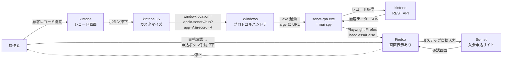
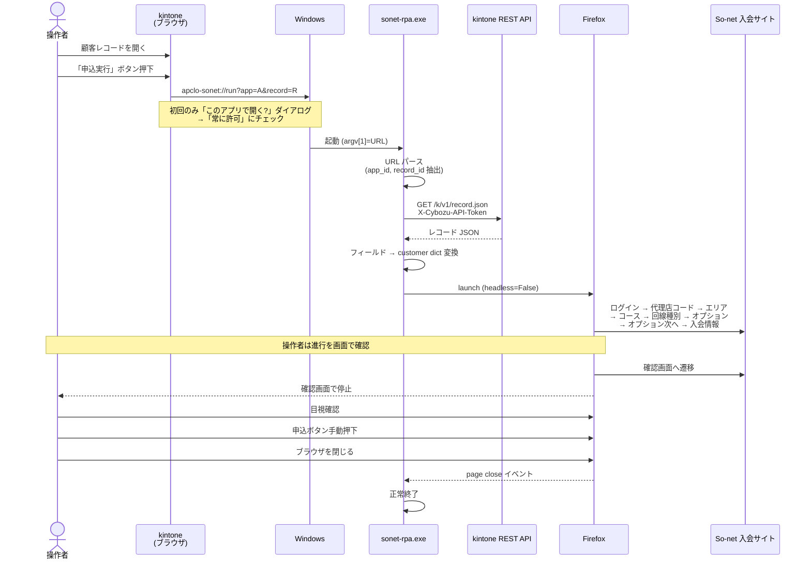

# So-net 自動エントリー RPA × kintone 連携 設計書

**作成日**: 2026-05-28
**対象**: `C:\AUTOET\automatic-update\` (既存 main.py の kintone トリガー化)

---

## 1. 目的・背景

So-net 入会申込の自動入力 (`main.py`) を **kintone レコードから 1クリック起動** できるようにする。
操作者は kintone 上の顧客レコードを開いた状態でボタンを押すだけで、ローカルPC上に Firefox が立ち上がり、自動でフォーム入力が走り、**確認画面で必ず停止**する。操作者が目視で内容を確認し、問題なければ手動で申込ボタンを押す。

設計の制約:
- 入力画面は操作者が見える状態で動かす（VPS不可、ローカル実行）
- 確認画面で必ず停止（誤申込防止）
- 実行結果・スクショの kintone 書き戻しは不要（操作者がその場で見ているため）

---

## 2. システム構成図



---

## 3. データフロー（シーケンス）



---

## 4. コンポーネント設計

### 4.1 kintone 側

**アプリ**: 顧客情報を保持するアプリ (既存 or 新規 — 要確認)

**必須フィールド** (`main.py` の customer_data.csv 25列に対応):

| フィールドコード | 種別 | 例 | 備考 |
|---|---|---|---|
| `agency_code` | 文字列1行 | `66EE14` | |
| `sei` / `mei` | 文字列1行 | 田中 / 太郎 | |
| `sei_kana` / `mei_kana` | 文字列1行 | タナカ / タロウ | |
| `gender` | ドロップダウン | 男性 / 女性 | |
| `birth_year` / `birth_month` / `birth_day` | 文字列1行 | 1990 / 01 / 15 | 月日は2桁ゼロ埋め |
| `postal_code1` / `postal_code2` | 文字列1行 | 904 / 2164 | 郵便番号を3桁+4桁で分離 |
| `town` / `banchi` / `go` | 文字列1行 | 桃原3丁目 / 8 / 10 | |
| `building` / `room` | 文字列1行 | ThinkPark Tower / 101 | 任意 |
| `phone1` / `phone2` / `phone3` | 文字列1行 | 090 / 1234 / 5678 | 3分割 |
| `building_type` | ドロップダウン | 戸建(持家) / 戸建(賃貸) / 集合住宅(分譲) / 集合住宅(賃貸) | |
| `line_type` | ドロップダウン | 利用していない / フレッツ・他社コラボ / その他 | |
| `line_apply_type` | ドロップダウン | 新設 / 転用 / 事業者変更 | |
| `course` | ドロップダウン | So-net光M_戸建_西日本 等 (COURSE_MAP の12種) | |
| `campaign_year` / `campaign_month` / `campaign_day` | 文字列1行 | 2026 / 04 / 14 | |
| `tenyou_no` | 文字列1行 | (任意) | 転用/事業者変更時のみ |

**JS カスタマイズ** (`sonet-rpa.js`):
```js
(function () {
  'use strict';
  kintone.events.on('app.record.detail.show', (event) => {
    const btn = document.createElement('button');
    btn.textContent = 'So-net 申込実行';
    btn.style.cssText =
      'padding:8px 16px;background:#0066cc;color:#fff;border:none;' +
      'border-radius:4px;cursor:pointer;font-weight:bold;';
    btn.onclick = () => {
      const appId = kintone.app.getId();
      const recordId = event.recordId;
      window.location.href =
        `apclo-sonet://run?app=${appId}&record=${recordId}`;
    };
    kintone.app.record.getHeaderMenuSpaceElement().appendChild(btn);
    return event;
  });
})();
```

### 4.2 Windows プロトコルハンドラ

**スキーム名**: `apclo-sonet` (社名プレフィックスで他アプリと衝突回避)

**`register_apclo-sonet.reg`** (各操作者PCで一度実行):
```reg
Windows Registry Editor Version 5.00

[HKEY_CURRENT_USER\Software\Classes\apclo-sonet]
@="URL:apclo Sonet RPA Protocol"
"URL Protocol"=""

[HKEY_CURRENT_USER\Software\Classes\apclo-sonet\shell\open\command]
@="\"C:\\Tools\\sonet-rpa\\sonet-rpa.exe\" \"%1\""
```

HKCU 配下なので **管理者権限不要**。

**`unregister.reg`** (アンインストール用):
```reg
Windows Registry Editor Version 5.00

[-HKEY_CURRENT_USER\Software\Classes\apclo-sonet]
```

### 4.3 ローカル実行体

**配置**: `C:\Tools\sonet-rpa\`
```
sonet-rpa.exe        ← PyInstaller でビルド (main.py + Firefox 同梱)
.env                 ← 操作者が初回に作成
logs\                ← 実行ログ
screenshots\         ← エラー時スクショ
```

**起動形式**: `sonet-rpa.exe "apclo-sonet://run?app=45&record=123"`

**処理シーケンス**:
1. `argv[1]` から URL を取得し `urllib.parse.urlparse` でパース
2. クエリから `app`, `record` を抽出 (両方とも数値であることを検証)
3. `.env` から kintone 接続情報・So-net 認証情報をロード
4. kintone REST API `GET /k/v1/record.json` でレコード取得
5. レコードの各フィールド `value` を取り出し、既存 `main.py` の customer dict 形式に変換
6. `process_customer(page, customer)` を呼ぶ (既存ロジックそのまま)
7. `step9_to_confirmation` 後、`page.wait_for_event("close", timeout=0)` でブラウザ終了待ち
8. ブラウザ終了 → プロセス終了

---

## 5. 既存 `main.py` からの変更点

| 箇所 | 現状 | 変更後 |
|---|---|---|
| 入力ソース | `csv.DictReader` で `customer_data.csv` を読む | `argv[1]` の URL から `app_id`/`record_id` を取り、kintone API でレコード取得 |
| エントリポイント | `run()` で複数顧客ループ | `run(url)` 形式に変更、1呼び出し=1顧客 |
| `--debug` / `--headless` | サポート | 削除 (常に画面表示) |
| ブラウザ終了待ち | `page.wait_for_event("close", timeout=0)` (既存) | そのまま流用 |
| エラー通知 | print のみ | ダイアログ表示 (`tkinter.messagebox`) + ログ保存 |

**新規追加モジュール**:
- `kintone_client.py`: API トークンでレコード取得
- `record_mapper.py`: kintone JSON → customer dict 変換
- `main_url.py` (or `main.py` 改修): URL受け取りのエントリポイント

---

## 6. 設定ファイル

`.env`:
```
KINTONE_DOMAIN=apclo.cybozu.com
KINTONE_API_TOKEN=xxxxxxxxxxxxxxxxxxxxxxxxxx
SONET_LOGIN_ID=xxxxxxxxxx
SONET_PASSWORD=xxxxxxxxxx
```

kintone API トークンには **対象アプリの「レコード閲覧」権限のみ**を付与 (書き込み不要)。

---

## 7. エラーハンドリング

| エラー種別 | 検知方法 | 動作 |
|---|---|---|
| URL パース失敗・引数不足 | argv 検証 | tkinter ダイアログ表示 → 終了 |
| `app` / `record` が数値でない | 正規表現検証 | ダイアログ → 終了 |
| kintone API HTTP エラー | status_code チェック | ダイアログ (ステータス・本文要約) → 終了 |
| 必須フィールド欠損 | 変換時 KeyError | ダイアログ (欠損フィールド名) → 終了 |
| Playwright 起動失敗 | try/except | ログ保存 → ダイアログ → 終了 |
| So-net バリデーションエラー | 既存 `step9` の d-caution 検知 | スクショ保存、ブラウザは閉じず操作者の判断に委ねる |

書き戻しなしのため、エラー通知は **ダイアログ + ログファイル** のみ。

---

## 8. セキュリティ

| 項目 | 対策 |
|---|---|
| So-net 認証情報 | ローカル `.env` のみ。kintone JS には絶対書かない |
| kintone API トークン | ローカル `.env`。閲覧権限のみ |
| URL スキーム経由の任意コード実行 | `app`/`record` を数値正規表現 `^\d+$` で検証。それ以外受け付けない |
| 別アプリとのスキーム衝突 | `apclo-sonet` という独自プレフィックス採用 |
| トークン流出 | `.env` は配布パッケージに含めない (`.env.example` のみ配布) |

---

## 9. 配布パッケージ

**`sonet-rpa-installer.zip`** に同梱するもの:
```
sonet-rpa.exe
.env.example          (秘密値は空欄、操作者が編集)
register_apclo-sonet.reg
unregister.reg
setup.md              (3ステップの手順書)
```

**初回セットアップ手順** (operator向け):
1. ZIP を `C:\Tools\sonet-rpa\` に展開
2. `.env.example` を `.env` にリネーム → API トークンと So-net 認証情報を記入
3. `register_apclo-sonet.reg` をダブルクリック → 「はい」
4. kintone でボタンを初めて押すとき「常に許可」にチェックを入れて「開く」を選択

---

## 10. 残課題・要確認事項

- [ ] kintone 既存アプリの調査: 顧客情報を持つアプリは既存か新規作成か
- [ ] フィールドコードのマッピング: main.py の dict キーと一致させるか変換マップを書くか
- [ ] PyInstaller ビルド検証: Playwright の Firefox を同梱すると数百MB級になる。許容できるか
- [ ] 配布方式: ファイルサーバ + 手動コピー / インストーラ作成 / アップデーター実装
- [ ] 既存 `customer_data.csv` パスの互換維持: 廃止 or 残置
- [ ] 操作ログの保存方針: ローカルのみで十分か、後で集約したいか
- [ ] 同一顧客で複数回押下した時の挙動: 多重起動を許容するか1プロセスに制限するか

---

## 11. スケジュール感

| 工程 | 工数目安 |
|---|---|
| kintone アプリ整備 (フィールド作成 or 既存マッピング確認) | 0.5日 |
| kintone JS カスタマイズ作成・適用 | 0.5日 |
| `main.py` 改修 (URL受け取り / kintone API取得 / 変換) | 0.5日 |
| PyInstaller ビルド & 動作検証 | 0.5日 |
| `.reg` + setup.md + 1台目セットアップ・通し動作確認 | 0.5日 |
| **合計** | **約 2.5日** |
