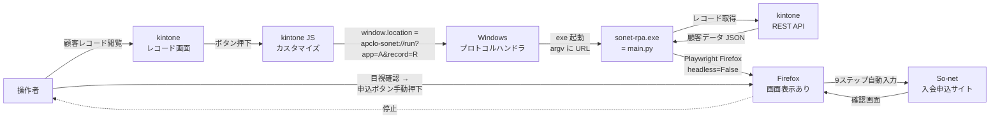
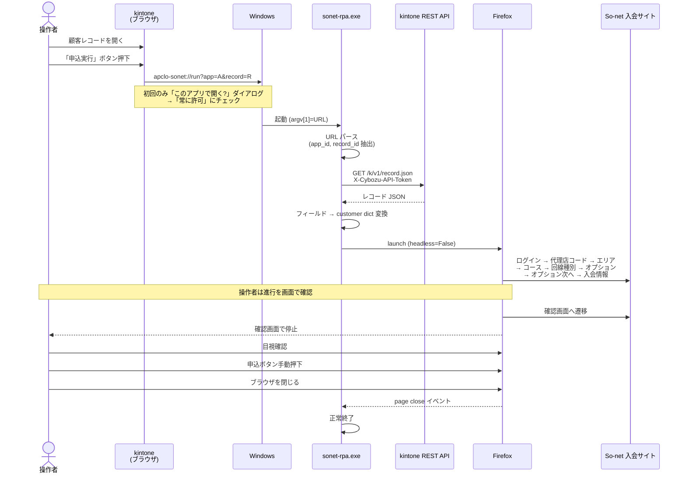

# So-net 自動エントリー RPA × kintone 連携 設計書

**作成日**: 2026-05-28
**対象**: `C:\AUTOET\automatic-update\` (既存 main.py の kintone トリガー化)

---

## 1. 目的・背景

So-net 入会申込の自動入力 (`main.py`) を **kintone レコードから 1クリック起動** できるようにする。
操作者は kintone 上の顧客レコードを開いた状態でボタンを押すだけで、ローカルPC上に Firefox が立ち上がり、自動でフォーム入力が走り、**確認画面で必ず停止**する。操作者が目視で内容を確認し、問題なければ手動で申込ボタンを押す。

設計の制約:
- 入力画面は操作者が見える状態で動かす（VPS不可、ローカル実行）
- 確認画面で必ず停止（誤申込防止）
- 実行結果・スクショの kintone 書き戻しは不要（操作者がその場で見ているため）

---

## 2. システム構成図



---

## 3. データフロー（シーケンス）



---

## 4. コンポーネント設計

### 4.1 kintone 側

**アプリ**: app_id=68 (`So-net光 NUW`、既存アプリ)

**対象範囲**: 申込区分が「新設」のレコードのみ。転用 / 事業者変更は未対応とし、起動直後にダイアログ表示して終了する。

**フィールドマッピング** (kintone 実フィールド → main.py customer dict):

| customer key | kintone fieldCode | kintone ラベル | 種別 | 変換ロジック |
|---|---|---|---|---|
| `agency_code` | `文字列__1行__36` | 代理店コード | 文字列1行 | そのまま |
| `sei` | `旧契約者姓_漢字` | 契約者姓 漢字 | 文字列1行 | そのまま |
| `mei` | `旧契約者名_漢字` | 契約者名 漢字 | 文字列1行 | そのまま |
| `sei_kana` | `旧契約者姓_カナ` | 契約者姓 カナ | 文字列1行 | そのまま |
| `mei_kana` | `旧契約者名_カナ` | 契約者名 カナ | 文字列1行 | そのまま |
| `gender` | `ドロップダウン` | 契約者性別 | DD | そのまま (男性 / 女性) |
| `birth_year/month/day` | `文字列__1行__19` | 契約者生年月日（8桁） | 文字列1行 | `YYYYMMDD` を 4/2/2 で分割 |
| `postal_code1` | `郵便番号前半` | 郵便番号（前半の3桁） | 文字列1行 | そのまま |
| `postal_code2` | `郵便番号後半` | 郵便番号（後半の4桁） | 文字列1行 | そのまま |
| `town` / `banchi` / `go` | `文字列__1行__11` | 住所 | 文字列1行 | スクリプトで分割（後述 §4.4.1） |
| `building` | `文字列__1行__12` | 建物名 | 文字列1行 | そのまま |
| `room` | `文字列__1行__13` | 部屋番号 | 文字列1行 | そのまま |
| `phone1/2/3` | `文字列__1行__6` | 連絡先電話番号 | 文字列1行 | 携帯=3-4-4 / 固定=3-3-4 で分割（後述 §4.4.2） |
| `building_type` | `ドロップダウン_2` + `ドロップダウン_3` | 住居形態 + 所有形態 | DD×2 | 直積で統合（後述 §4.4.3） |
| `line_type` | `ドロップダウン_4` | 現状回線 | DD | そのまま |
| `line_apply_type` | `文字列__1行__32` | 申込区分 | 文字列1行 | 「新設」固定。値が「新設」以外なら起動拒否 |
| `course` | `申込みプラン` | 申込プラン新 | DD | COURSE_MAP に通す。申込区分=新設で弾かれるためここでの値検証は不要 |
| `campaign_year/month/day` | (kintone 側に無し) | — | — | **実行日 (today) を YYYY/MM/DD で設定** |
| `tenyou_no` | — | — | — | 不要（転用は未対応のため読み取らない） |

**JS カスタマイズ** (`sonet-rpa.js`):
```js
(function () {
  'use strict';
  kintone.events.on('app.record.detail.show', (event) => {
    const btn = document.createElement('button');
    btn.textContent = 'So-net 申込実行';
    btn.style.cssText =
      'padding:8px 16px;background:#0066cc;color:#fff;border:none;' +
      'border-radius:4px;cursor:pointer;font-weight:bold;';
    btn.onclick = () => {
      const appId = kintone.app.getId();
      const recordId = event.recordId;
      window.location.href =
        `apclo-sonet://run?app=${appId}&record=${recordId}`;
    };
    kintone.app.record.getHeaderMenuSpaceElement().appendChild(btn);
    return event;
  });
})();
```

### 4.1.1 起動可否判定（申込区分チェック）

レコード取得直後、`文字列__1行__32`（申込区分）の値で対象判定:

| 申込区分 | 動作 |
|---|---|
| `新設` | 通常処理続行 |
| `転用` / `事業者変更` / その他 / 空 | tkinter ダイアログで「未対応の申込区分です: 〇〇」を表示し終了 |

この判定により、転用承諾番号 / 事業者変更承諾番号 / 希望日の読み取り・入力は不要となる。

### 4.1.2 データ変換ロジック

#### 4.1.2.1 住所分割（`文字列__1行__11` → town / banchi / go）

入力例: `沖縄県浦添市桃原3丁目8-10` または `沖縄県浦添市桃原3丁目8番地10号`

アルゴリズム:
1. **市区町村抽出**: 先頭から `都道府県` + `市区町村` 部分を正規表現で剥がす
   - 都道府県は固定リスト（47件）でマッチ
   - 市区町村は `(.+?[市区町村郡])` で貪欲でない最長一致
   - 京都市・大阪市など政令指定都市の「○○区」も含める
2. **末尾の番地/号抽出**: 残った文字列の末尾から、以下の優先順で番地/号を抽出
   - `\d+番地?\s*\d+号?` → banchi / go に分離（漢字「番地」「号」、半角ハイフン「-」「‐」全てを許容）
   - `\d+番地?` のみ → banchi に格納、go は空
   - 抽出できなければ banchi / go は空
3. **残りを town に格納**: 「桃原3丁目」のような町名+丁目部分。漢数字（一二三〇）→ 半角数字に正規化

実装は `record_mapper.py` 内 `split_address(addr: str) -> dict`。失敗ケース（市区町村が辞書に無い・末尾が想定外フォーマット）は **部分的に埋まった状態で So-net 確認画面に進む**（確認画面で停止する設計なので操作者が目視修正可能）。

依存: 都道府県・政令指定都市リストは Python ファイルに直書き（外部ライブラリ不要）。

#### 4.1.2.2 電話番号分割（`文字列__1行__6` → phone1 / phone2 / phone3）

入力例: `09012345678` / `0312345678` / `090-1234-5678` (ハイフン除去後に処理)

判定:
- 先頭3桁が `070` / `080` / `090` → **携帯**: 3-4-4 で分割
- それ以外 → **固定**: 3-3-4 で分割

ハイフン・全角数字は事前に除去/正規化。桁数が10桁/11桁でなければエラーダイアログ。

#### 4.1.2.3 住居形態統合（`ドロップダウン_2` + `ドロップダウン_3` → building_type）

| 住居形態 | 所有形態 | building_type |
|---|---|---|
| 戸建 | 持家 | `戸建(持家)` |
| 戸建 | 賃貸 | `戸建(賃貸)` |
| 集合住宅 | 分譲 | `集合住宅(分譲)` |
| 集合住宅 | 賃貸 | `集合住宅(賃貸)` |

組み合わせが想定外（空・他値）の場合はエラーダイアログ。

#### 4.1.2.4 生年月日分割（`文字列__1行__19` → birth_year / birth_month / birth_day）

`YYYYMMDD` 8桁を `[0:4]` / `[4:6]` / `[6:8]` で分割。8桁数字でなければエラーダイアログ。

#### 4.1.2.5 キャンペーン適用日

kintone 側にフィールド無し。**実行時の当日**を以下に設定:
- `campaign_year` = `today.year`
- `campaign_month` = `f"{today.month:02d}"`
- `campaign_day` = `f"{today.day:02d}"`

### 4.2 Windows プロトコルハンドラ

**スキーム名**: `apclo-sonet` (社名プレフィックスで他アプリと衝突回避)

**`register_apclo-sonet.reg`** (各操作者PCで一度実行):
```reg
Windows Registry Editor Version 5.00

[HKEY_CURRENT_USER\Software\Classes\apclo-sonet]
@="URL:apclo Sonet RPA Protocol"
"URL Protocol"=""

[HKEY_CURRENT_USER\Software\Classes\apclo-sonet\shell\open\command]
@="\"C:\\Tools\\sonet-rpa\\sonet-rpa.exe\" \"%1\""
```

HKCU 配下なので **管理者権限不要**。

**`unregister.reg`** (アンインストール用):
```reg
Windows Registry Editor Version 5.00

[-HKEY_CURRENT_USER\Software\Classes\apclo-sonet]
```

### 4.3 ローカル実行体

**配置**: `C:\Tools\sonet-rpa\`
```
sonet-rpa.exe        ← PyInstaller でビルド (main.py + Firefox 同梱)
.env                 ← 操作者が初回に作成
logs\                ← 実行ログ
screenshots\         ← エラー時スクショ
```

**起動形式**: `sonet-rpa.exe "apclo-sonet://run?app=45&record=123"`

**処理シーケンス**:
1. `argv[1]` から URL を取得し `urllib.parse.urlparse` でパース
2. クエリから `app`, `record` を抽出 (両方とも数値であることを検証)
3. `.env` から kintone 接続情報・So-net 認証情報をロード
4. kintone REST API `GET /k/v1/record.json` でレコード取得
5. レコードの各フィールド `value` を取り出し、既存 `main.py` の customer dict 形式に変換
6. `process_customer(page, customer)` を呼ぶ (既存ロジックそのまま)
7. `step9_to_confirmation` 後、`page.wait_for_event("close", timeout=0)` でブラウザ終了待ち
8. ブラウザ終了 → プロセス終了

---

## 5. 既存 `main.py` からの変更点

| 箇所 | 現状 | 変更後 |
|---|---|---|
| 入力ソース | `csv.DictReader` で `customer_data.csv` を読む | `argv[1]` の URL から `app_id`/`record_id` を取り、kintone API でレコード取得 |
| エントリポイント | `run()` で複数顧客ループ | `run(url)` 形式に変更、1呼び出し=1顧客 |
| `--debug` / `--headless` | サポート | 削除 (常に画面表示) |
| ブラウザ終了待ち | `page.wait_for_event("close", timeout=0)` (既存) | そのまま流用 |
| エラー通知 | print のみ | ダイアログ表示 (`tkinter.messagebox`) + ログ保存 |

**新規追加モジュール**:
- `kintone_client.py`: API トークンでレコード取得
- `record_mapper.py`: kintone JSON → customer dict 変換
- `main_url.py` (or `main.py` 改修): URL受け取りのエントリポイント

---

## 6. 設定ファイル

`.env`:
```
KINTONE_DOMAIN=apclo.cybozu.com
KINTONE_API_TOKEN=xxxxxxxxxxxxxxxxxxxxxxxxxx
SONET_LOGIN_ID=xxxxxxxxxx
SONET_PASSWORD=xxxxxxxxxx
```

kintone API トークンには **対象アプリの「レコード閲覧」権限のみ**を付与 (書き込み不要)。

---

## 7. エラーハンドリング

| エラー種別 | 検知方法 | 動作 |
|---|---|---|
| URL パース失敗・引数不足 | argv 検証 | tkinter ダイアログ表示 → 終了 |
| `app` / `record` が数値でない | 正規表現検証 | ダイアログ → 終了 |
| kintone API HTTP エラー | status_code チェック | ダイアログ (ステータス・本文要約) → 終了 |
| 申込区分が「新設」以外 | レコード取得直後に値チェック | ダイアログ「未対応の申込区分: 〇〇」→ 終了 |
| 生年月日が8桁数字でない | 変換時 ValueError | ダイアログ → 終了 |
| 電話番号の桁数が10/11桁でない | 変換時 ValueError | ダイアログ → 終了 |
| 住居形態×所有形態が想定外 | マッピング辞書未ヒット | ダイアログ → 終了 |
| 住所分割の失敗 | 市区町村が辞書外 / 末尾フォーマット不一致 | 部分的に埋めた状態で続行（確認画面で目視修正前提）|
| 必須フィールド欠損 | 変換時 KeyError | ダイアログ (欠損フィールド名) → 終了 |
| Playwright 起動失敗 | try/except | ログ保存 → ダイアログ → 終了 |
| So-net バリデーションエラー | 既存 `step9` の d-caution 検知 | スクショ保存、ブラウザは閉じず操作者の判断に委ねる |

書き戻しなしのため、エラー通知は **ダイアログ + ログファイル** のみ。

---

## 8. セキュリティ

| 項目 | 対策 |
|---|---|
| So-net 認証情報 | ローカル `.env` のみ。kintone JS には絶対書かない |
| kintone API トークン | ローカル `.env`。閲覧権限のみ |
| URL スキーム経由の任意コード実行 | `app`/`record` を数値正規表現 `^\d+$` で検証。それ以外受け付けない |
| 別アプリとのスキーム衝突 | `apclo-sonet` という独自プレフィックス採用 |
| トークン流出 | `.env` は配布パッケージに含めない (`.env.example` のみ配布) |

---

## 9. 配布パッケージ

**`sonet-rpa-installer.zip`** に同梱するもの:
```
sonet-rpa.exe
.env.example          (秘密値は空欄、操作者が編集)
register_apclo-sonet.reg
unregister.reg
setup.md              (3ステップの手順書)
```

**初回セットアップ手順** (operator向け):
1. ZIP を `C:\Tools\sonet-rpa\` に展開
2. `.env.example` を `.env` にリネーム → API トークンと So-net 認証情報を記入
3. `register_apclo-sonet.reg` をダブルクリック → 「はい」
4. kintone でボタンを初めて押すとき「常に許可」にチェックを入れて「開く」を選択

---

## 10. 残課題・要確認事項

- [x] kintone 既存アプリの調査 → **app_id=68 (So-net光 NUW) 既存利用**
- [x] フィールドコードのマッピング → §4.1 で確定
- [x] 対象範囲 → **申込区分=新設のみ。転用・事業者変更は未対応**
- [x] キャンペーン適用日 → **実行日 (today) で固定**
- [ ] 住所分割の精度検証: 実レコードの住所サンプル数十件で `split_address` を試走し、失敗パターンを洗い出す
- [ ] PyInstaller ビルド検証: Playwright の Firefox を同梱すると数百MB級になる。許容できるか
- [ ] 配布方式: ファイルサーバ + 手動コピー / インストーラ作成 / アップデーター実装
- [ ] 既存 `customer_data.csv` パスの互換維持: 廃止 or 残置
- [ ] 操作ログの保存方針: ローカルのみで十分か、後で集約したいか
- [ ] 同一顧客で複数回押下した時の挙動: 多重起動を許容するか1プロセスに制限するか

---

## 11. スケジュール感

| 工程 | 工数目安 |
|---|---|
| kintone アプリ整備 (フィールド作成 or 既存マッピング確認) | 0.5日 |
| kintone JS カスタマイズ作成・適用 | 0.5日 |
| `main.py` 改修 (URL受け取り / kintone API取得 / 変換) | 0.5日 |
| PyInstaller ビルド & 動作検証 | 0.5日 |
| `.reg` + setup.md + 1台目セットアップ・通し動作確認 | 0.5日 |
| **合計** | **約 2.5日** |
